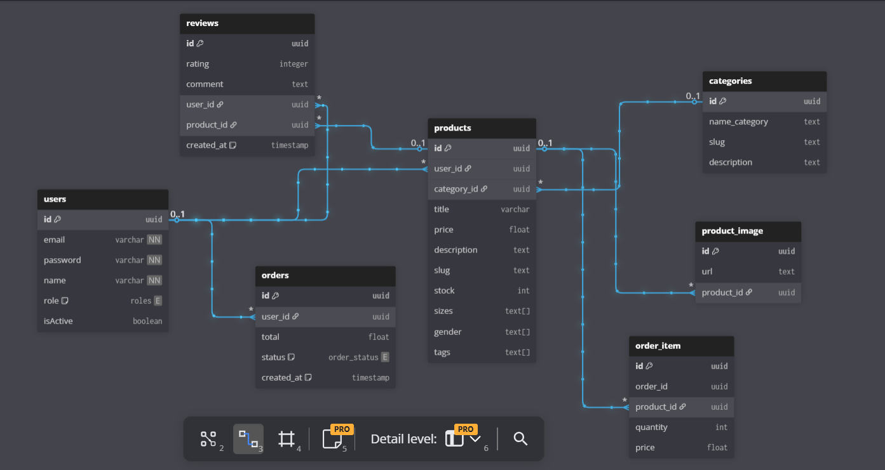

# 🛒 E-Commerce Marketplace API

<p align="center">
  <a href="http://nestjs.com/" target="blank">
    
  </a>
</p>

<p align="center">
  
  
  
  
  
</p>

A modular RESTful API built with **NestJS**, **TypeScript**, and **PostgreSQL**. The project implements relational database entities, role-based access control (RBAC), containerized database environments, and automated End-to-End (E2E) testing suites.

---

## 📊 Database Schema

The relational data model handles catalog management, user accounts, and purchase history. It utilizes UUID primary keys, explicit constraints, and cascading rules managed via TypeORM:



### Architectural Highlights:

- **Users & Access Control:** Implements role-based authorization using an Enum field (`admin`, `user`, `superUser`) paired with NestJS Guards to restrict endpoint access based on account privileges.
- **Products & Imagery:** Uses a One-to-Many (`@OneToMany`) relationship to bind product entries with an image gallery, applying an `onDelete: 'CASCADE'` constraint to handle cleanup and prevent orphan records.
- **Order Lifecycle Snapshots:** Manages the Many-to-Many relationship between orders and products via an explicit `order_item` entity, capturing and freezing the historical price of items at the exact time of purchase.
- **User Reviews:** Connects users and products through a relational `reviews` entity to store product ratings and feedback text dynamically.

---

## ⚙️ Quick Start & Installation

### 📋 Prerequisites

Make sure you have [Git](https://git-scm.com/), [Node.js](https://nodejs.org/) (v18+ recommended), and [Docker Desktop](https://www.docker.com/products/docker-desktop/) installed and running on your machine.

---

### 1. Clone the Repository

```bash
git clone https://github.com/Emiliano-Merelez-dev/nestjs-marketplace-api.git
cd nestjs-marketplace-api
```

### 2. Environment Setup

Create a .env file in the root directory. Copy this template and fill in your local credentials:

```bash
# Database Configuration (PostgreSQL)
DB_PASSWORD=
DB_NAME=
DB_USERNAME=
DB_HOST=
DB_PORT=

# Security & Sessions
JWT_SECRET=
PORT=

# PayPal Payment Gateway Integration
PAYPAL_CLIENT_ID=
PAYPAL_SECRET=
PAYPAL_OAUTH_URL=
PAYPAL_ORDERS_URL=

# Seller Automated Mailing Services
EMAIL=
PASSWORD=

# Sandbox Testing Credentials
BUYER_EMAIL=
PASSWORD_WITH_BUYER=
```

### 3. Spin Up Infrastructure

Launch the local PostgreSQL database container:

```bash
docker compose up -d
```

### 4. Install Dependencies

Install the required Node.js modules for the application:

```bash
npm install
```

### 5. Run the Application

Launch the NestJS application in development mode:

```bash
npm run start:dev
```

The API will be available at: http://localhost:3000/api

### 6. Seed the Database

To facilitate local development and API testing, trigger the seeding script to populate the database:

**Option A** (Recommended): Open your browser and navigate to the interactive Swagger Documentation at http://localhost:3000/api. Locate the Seed controller, expand the GET method, click "Try it out", and press "Execute".

**Option B**: Send a direct HTTP request using Postman or any API client:

```bash
GET http://localhost:3000/api/seed
```

What this does: Populates the database with relational mock data (users, categories, products, reviews, and orders) for local development and testing purposes.

## API Endpoints

Private routes require passing a signed JWT Bearer Token in the authorization header:

| Method   | Endpoint                 | Access                      | Description                                                                                   |
| :------- | :----------------------- | :-------------------------- | :-------------------------------------------------------------------------------------------- |
| **POST** | `/api/auth/register`     | Public                      | Registers a new user and returns a signed session JWT.                                        |
| **POST** | `/api/auth/login`        | Public                      | Validates credentials and issues a signed session JWT.                                        |
| **GET**  | `/api/auth/check-status` | Private (All Roles)         | Validates active tokens and handles automatic lifecycle renewal.                              |
| **POST** | `/api/products`          | Protected (Admin/SuperUser) | Creates catalog entries with linked multi-image gallery uploads.                              |
| **GET**  | `/api/products`          | Public                      | Fetches complete paginated lists of catalog entries.                                          |
| **POST** | `/api/orders`            | Private (User)              | Commits transaction tickets capturing product snapshot configurations.                        |
| **POST** | `/api/orders/pay`        | Private (User)              | Intercepts the PayPal `transaction_id`, validates payment state, and updates order lifecycle. |

## Testing & Quality Assurance

Automated End-to-End (.e2e-spec.ts) test suites are implemented using Jest and Supertest to validate route security, request validation payloads (ValidationPipes), and role hierarchy constraints under simulated execution contexts.

To execute the test suites:

```bash
npm run test:e2e
```

To run tests in watch mode during development:

```bash
npm run test:e2e:watch
```
